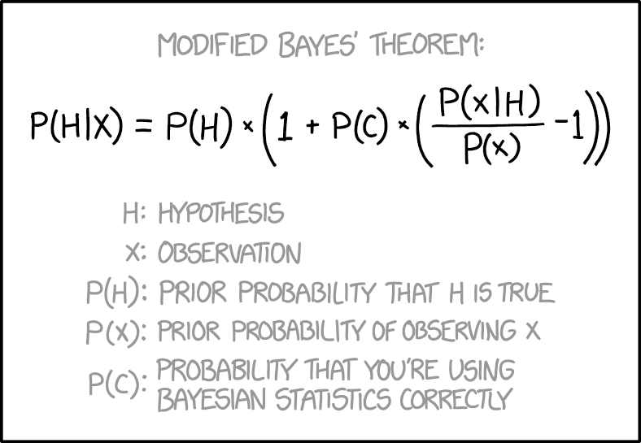

# (PART\*) Part I: Getting Started {-}

# Basic Bayesian Analysis

The classic formula:

$$p(\mathcal{A}|\mathcal{B}) = \frac{p(\mathcal{B}|\mathcal{A})p(\mathcal{A})}{p(\mathcal{B})}$$

Conceptually, we can think about it in different ways.

$$posterior \propto likelihood * prior$$

Standard methods you are already familiar with begin and end with likelihood.

Alternatively, we can think also in terms of the posterior as the combination hypothesis, and evidence, in the form of data. 

$$p(hypothesis|data) \propto p(data|hypothesis)p(hypothesis)$$

$$\text{updated belief} = \text{current evidence} * \text{prior belief or evidence}$$

Some key distinctions: 

 - Distributions and uncertainty estimation instead of point estimates
 - However, given the distribution for a parameter, we still obtain point estimates
 - Easy model criticism

http://micl.shinyapps.io/prior2post/

