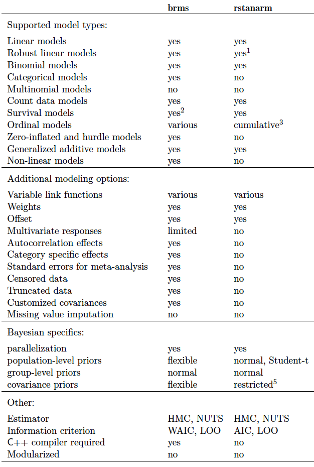
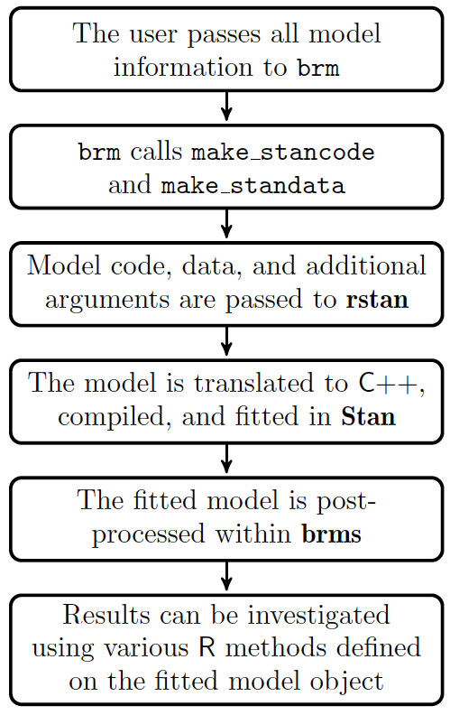

# (PART\*) Part III: brms {-}


# Installing brms

- <span class="pack">rstan</span> installation required
- Installed as any other R package


# Comparison to rstanarm

<span class="pack">brms</span> offers more modeling capabilities, flexibility with priors, and more[^tabledated]



[^tabledated]: This table is from the current vignette but dated. For example, <span class="pack">brms</span> does impute missing values in multiple ways even.

# Models



## Methods for brmsfit objects

This is all the fun stuff to play with after running a model

```{r brm_methods, eval=TRUE}
methods(class = 'brmsfit')
```


## Models in brms

The modeling syntax with brms mimics base R and some of the more popular packages:

- <span class="pack">base R</span>
- <span class="pack">lme4</span>
- <span class="pack">mgcv</span>
- <span class="pack">survival</span>

## brms: Mixed Model

We'll start with the mixed model from before

Like <span class="pack">rstanarm</span>, <span class="pack">brms</span> follows <span class="pack">lme4</span>'s syntax

```{r brms_mixed}
sleepstudy_brms <- brm(Reaction ~ Days + (1 + Days|Subject), 
                       data = sleepstudy)
summary(sleepstudy_brms)
```

```{r brms_mixed_show, eval=TRUE, echo=FALSE}
summary(sleepstudy_brms)
```


## brms: Mixed Model Extensions

Just with mixed models, we already start to see what <span class="pack">brms</span> brings to the table

- additional distributions: ordinal, zero-inflated, beta and many more
- Correlated residuals, Additive mixed models, non-linear with known form, heterogeneous variance components, correlated random effects across multivariate outcomes, and more

```{r examples}
# auto regressive residual structure
model <- brm(Reaction ~ Days + (1 + Days|Subject), 
             data = sleepstudy, 
             correlation = cor_ar(~Days))

# multi-membership models
model <- brm(DV ~ x + (1|mm(group_1, group_2)), 
             data = sleepstudy, 
             correlation = cor_ar(~Days))

# smooth terms
model <- brm(Reaction ~ s(Days) + (1 + Days|Subject), 
             data = sleepstudy)

# use gaussian process instead
model <- brm(Reaction ~ gp(Days) + (1 + Days|Subject), 
             data = sleepstudy)

# multivarate outcome; q is an arbitrarily named identifier connecting random
# effects.
f1 = bf(DV_1 ~ x + 1|q|group)
f2 = bf(DV_2 ~ x + 1|q|group)
f = f1 + f2

model <- brm(f, data = mydata)

```


## brms: Mo' models, mo' models, mo' models!


- GAM
- Distributional response (e.g. model the variance as well as the mean)
- Gaussian Processes
- ZIP
- Multivariate
- Missing data imputation from a Bayesian approach
- Measurement error


```{r mo_models}
# additional distributions
model = brm(y ~ x + z, family = skew_normal,
                                student,
                                shifted_lognormal,
                                weibull,
                                frechet,
                                gen_extreme_value,
                                exgaussian,
                                wiener,
                                Beta,
                                von_mises,
                                asym_laplace,
                                hurdle_poisson,_negbinomial,_gamma,_lognormal,
                                zero_inflated_poisson,_negbinomial,_beta,_binomial; zero_one_inflated_beta,
                                categorical,
                                ordinal: cumulative, sratio, cratio, acat)

# model the variance as well as the mean
fit1 <- brm(bf(y ~ x + z, sigma ~ x), 
            data = dat1, 
            family = gaussian)

# missing values
bform <- bf(bmi | mi() ~ age * mi(chl)) +
  bf(chl | mi() ~ age) + set_rescor(FALSE)
fit <- brm(bform, data = nhanes)

# non-linear model with known form
nlform <- bf(cum ~ ult * (1 - exp(-(dev / theta)^omega)),
             ult ~ 1 + (1 | AY), omega ~ 1, theta ~ 1, nl = TRUE)

# measurement error
fit1 <- brm(y ~ me(x1, sdx) + me(x2, sdx), 
            data = dat, 
            save_mevars = TRUE)
```

