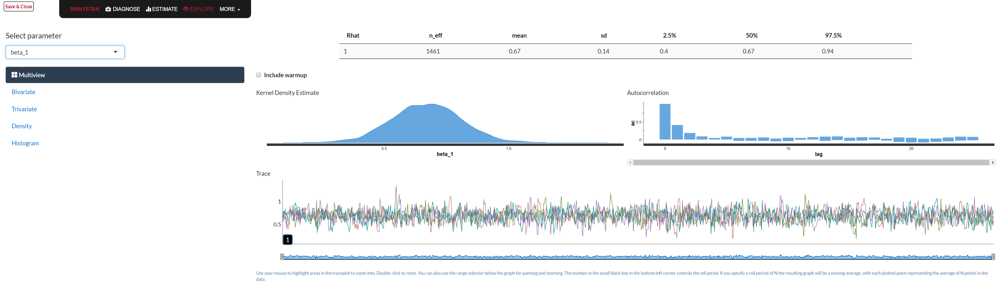

# (PART\*) Part IV: Model Criticism {-}

# Model Criticism in rstanarm and brms

- Much of the core functionality is the same across both packages
- Functions that exist in both are identical
- We will focus on brms, which has some extras

# Model Exploration

## Linear models

Get a simple coefficient plot[^visibly]

```{r stanplot_coef, eval=TRUE}
stanplot(attendance_brms)
```


For linear models, one might be interested in some notion of $R^2$

Automatically get an interval estimate as well

```{r brms_R2, eval=TRUE}
fit <- brm(mpg ~ wt + cyl, data = mtcars, refresh = 0)
bayes_R2(fit, digits=2)
```

Mixed models can include random effects or not

```{r brms_R2_mixed, eval=TRUE}
bayes_R2(sleepstudy_brms, re_formula = NA)
```

```{r brms_R2_mixed_with_re, eval=TRUE}
bayes_R2(sleepstudy_brms)
```


[^visibly]: I prefer my own package [visibly](https://m-clark.github.io/visibly/reference/plot_coefficients.html) for this.  There are a couple other plotting functions for some of the common <span class="pack">brms</span> models (e.g. glm, mixed)


## Marginal effects


<span class="pack">brms</span> allows one to to plot marginal effects

For standard linear models this is useful for group comparisons and interactions

For nonlinear models (glm and beyond) useful for any effect

```{r brms_marginal, eval=TRUE}
marginal_effects(attendance_brms)
```


## Hypothesis tests

Null hypothesis testing doesn't apply to the Bayesian context

However, we can still ask questions about the probability of certain outcomes

```{r brms_hype, eval=TRUE}
attendance_brms

hypothesis(attendance_brms, 'genderMale < -.2')

hypothesis(attendance_brms, 'progGeneral/progAcademic > 1')
```


## Extracting results

If there is something specific you need to do with the results, it is easy to get access to the output

```{r brms_extract, eval=TRUE}
posterior_samples(attendance_brms, pars = 'math') %>% head()

posterior_samples(attendance_brms, pars = 'math') %>% 
  qplot(data=., x = b_math, geom = 'density')
```


### Tidy methods for data extraction

The broom package can make your model results easier to work with

```{r tidy_brms, eval=TRUE}
library(broom)
tidy(attendance_brms)
```

```{r tidy_kable, eval=TRUE}
library(kableExtra)
tidy(attendance_brms) %>% 
  filter(grepl(term, pattern = '^b')) %>% 
  mutate(term = c('Intercept', 'Math', 'Male', 'General', 'Academic')) %>% 
  rename_all(str_to_title) %>% 
  kable(digits = 2)
```


### tidybayes

Bayesian analysis + tidy data + geoms

```{r tidybayes_add1, eval=TRUE}
library(tidybayes)
attendance %>% 
  add_fitted_draws(attendance_brms)
```


```{r tidybayes_add2, echo=FALSE}

attendance %>%
  data_grid(math = seq_along(math),
            gender = levels(gender),
            prog = levels(prog)) %>%  # modelr package
  add_predicted_draws(attendance_brms) %>%
  ggplot(aes(x = math)) +
  stat_lineribbon(aes(y = .prediction), .width = c(.99, .95, .8, .5)) +
  geom_point(aes(y = daysabs), data = attendance, alpha=.25) +
  scico::scale_fill_scico_d(alpha=.5, palette = 'tokyo')
```


```{r tidybayes_add3, eval=TRUE}
sleepstudy %>%
  modelr::data_grid(Days = Days,
                    Subject = levels(Subject)) %>% 
  add_predicted_draws(sleepstudy_brms) %>%
  ggplot(aes(x = Days)) +
  stat_lineribbon(aes(y = .prediction), 
                  color = NineteenEightyR::electronic_night()[1],
                  .width = seq(.5, .99, by = .01), 
                  alpha = .5,
                  show.legend = F) +
  geom_point(aes(y = Reaction), data = sleepstudy, alpha=.25) +
  scico::scale_fill_scico_d(alpha=.1, palette = 'acton', direction = -1)
```


Questions about <span class="pack">tidybayes</span> may be shouted across the street `r emo::ji('grinning')`

- Developed by Matthew Kay Assistant Professor at UMSI


```{r visibly, echo=FALSE}
visibly::plot_coefficients(attendance_brms)
visibly::plot_coefficients(sleepstudy_brms, ranef=T, which_ranef = 'Subject')[[1]]
```


# Model Diagnostics

Numerous model diagnostics are available to the Bayesian analyst


The Stan ecosystem makes exploring these not only easy, but fun!

## Shiny stan

<span class="pack">shinystan</span> allows for interactive exploration of model diagnostics

Just use <span class="func">launch_shinystan</span> on any model object from <span class="pack">rstan</span>, <span class="pack">rstanarm</span>, or <span class="pack">brms</span>

```{r shinystan}
launch_shinystan(attendance_brms)
```




## Posterior Predictive Checks

<span class="emph">Posterior predictive checks</span> can let us inspect what the model suggests for our target variable vs. what actually is the case

```{r pp_check, eval=TRUE}
pp_check(attendance_brms)
```

The Poisson's underlying assumption of the mean equaling the variance rarely holds with typical data. One way to handle overdispersion in count models is to move to something like negative binomial or other approaches.  Interestingly, for Poisson models we can have a random effect per observation (even in the non-Bayesian context)[^pln] to model additional variance.  In this case, our pp_check suggests a much better result.

```{r pp_check2_init}
attendance_brms_add_re = update(attendance_brms, . ~ . + (1|id), 
                                newdata = attendance)
pp_check(attendance_brms_add_re)
```

```{r pp_check2, echo=FALSE, eval=TRUE}
attendance_brms_add_re = update(attendance_brms, . ~ . + (1|id), cores=4, newdata = attendance, refresh=0)
pp_check(attendance_brms_add_re)
```

For more on this see [Ben Bolker's demonstration with lme4](https://glmm.wdfiles.com/local--files/examples/overdispersion.pdf).


## Observation Level

We can get into observation level diagnostics as well

While the process is technical, we can use the simple visualization to note 'outliers'[^psis]
- Think of it as leave-one-out (LOO) cross-validation error for a single data point

Look for values above .7 (though this default can be changed)

```{r loo_plot, eval=TRUE}
plot(loo(attendance_brms))
title('')
```

# Model Performance
## Prediction

The usual methods of fitted 

## Model Comparison

Model comparison can be achieved in much the same way we do with standard models

<span class="emph">WAIC</span> = widely applicable information criterion
-  a Bayesian AIC (lower is better)

In the Bayesian context, we would have a distribution for the WAIC also


```{r WAIC, eval=TRUE}
waic(attendance_brms, attendance_brms_add_re)
```

## Model Averaging

Why choose a model?

Average predictions across models via <span class="emph">stacking</span>

<!-- $$p(M_k|y) = \frac{p(y|M_k)p(M_k)}{\Sigma_{k=1}^K p(y|M_k)p(M_k)}$$ -->

```{r model_averaging, echo=1, eval=3:4}
pp_average(attendance_brms, attendance_brms_add_re)

pp_average(attendance_brms, attendance_brms_add_re) %>% 
  head()
```


[^pln]: This essentially changes the model to incorporate a Poisson log-normal distribution.  As @montesinos-lopez_bayesian_2017 describe:
> The Poisson component of the Poisson-lognormal distribution accommodates integer inputs (or outputs) to describe the actual number of counts observed within a single unit or sample, while the lognormal component of the distribution describes the overdispersion in the Poisson rate parameter...

<!-- https://www.ncbi.nlm.nih.gov/pmc/articles/PMC5427491/ -->

[^psis]: Pareto smoothed importance sampling.  See @vehtari_pareto_2017 and @vehtari_practical_2017 for details.