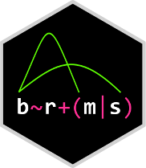

# Stan and the Stan ecosystem

## Stan 


<br>

Probabilistic programming language

HMC/NUTS

Compared to others: 

- Fast convergence
- No conjugacy required
- warmup vs. burnin
- less autocorrelation
- faster for more complex models

###

```{stan example_code, eval=FALSE, output.var="ex1", echo=-1, cache=FALSE}
# until this is ready just leave as R since it borks after one run and refuses to not eval
data {                      // Data block
  int<lower=1> N;           // Sample size
  int<lower=1> K;           // Dimension of model matrix
  matrix[N, K] X;           // Model Matrix
  vector[N] y;              // Target variable
}

parameters {                // Parameters block
  vector[K] beta;           // Coefficient vector
  real<lower=0> sigma;      // Error scale
}

model {                     // Model block
  vector[N] mu;
  mu = X * beta;            // Creation of linear predictor
  
  // priors
  beta ~ normal(0, 10);
  sigma ~ cauchy(0, 5);     // With sigma bounded at 0, this is half-cauchy
  
  // likelihood
  y ~ normal(mu, sigma);
}
```


## rstan


Allows one to use Stan within R.

Model can be: 

- a character string
- separate file with model expressed in the Stan language 

RStudio support for Stan (e.g. syntax highlighting)

rstan runs the model, and provides a lot of other tools to assess.

```{r rstan_example}
results = stan(model_code = my_model, data = my_data_list)
```


We will not cover this package.


## rstanarm

Developed by Stan team.

Good for basic to intermediate, and even somewhat complex models.

Precompiled stan code. 

- Standard models run very quickly
- Without compilation will always be faster than brms


## brms



Developed along with Stan team (though by one person)

Good for basic to complex models.

Not pre-compiled

- Some simpler models with less data would take longer for compilation than to run.

Extremely rapid feature integration.

##  More Stan

Many package to explore the results of a Stan model from any of these packages.

- shinystan
- tidybayes etc.